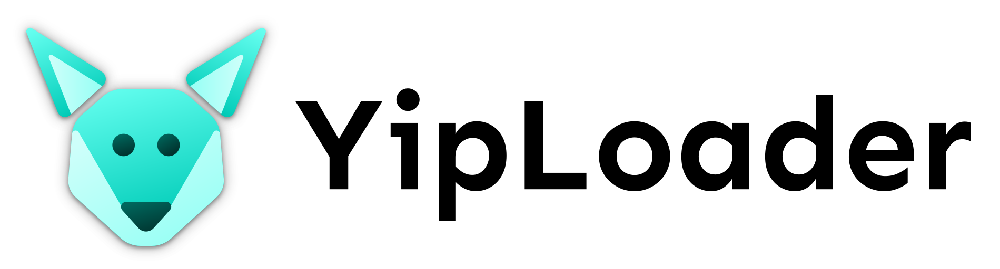

# YipLoader

YipLoader is a mod loader for Android games. It loads before the game's native library and uses a custom ELF loader and hooking library, Leaf, to provide the minimum needed tools to modify games at runtime on even the newest versions of Android (as of Android 16).

## Supported Games

YipLoader is a very early fork of KnShim, so it should support those games to a very limited extent (keep in mind YipLoader doesn't provide anything by default, unlike KnShim).

## Building

Install the Android NDK, then build using:

```
ndk-build
```
